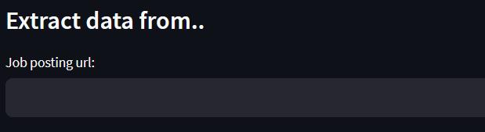
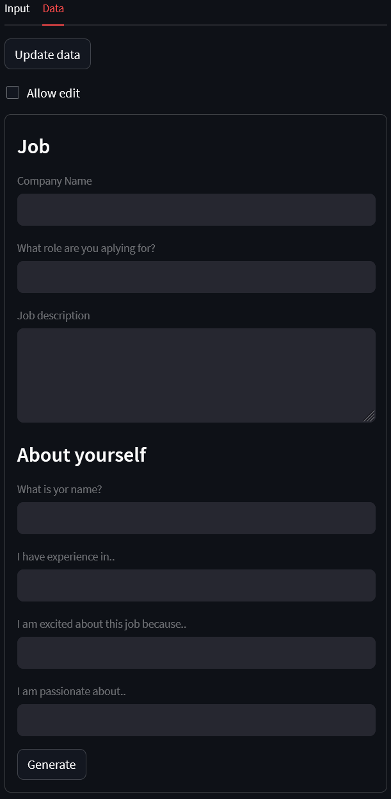
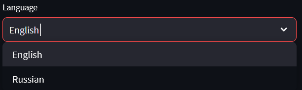
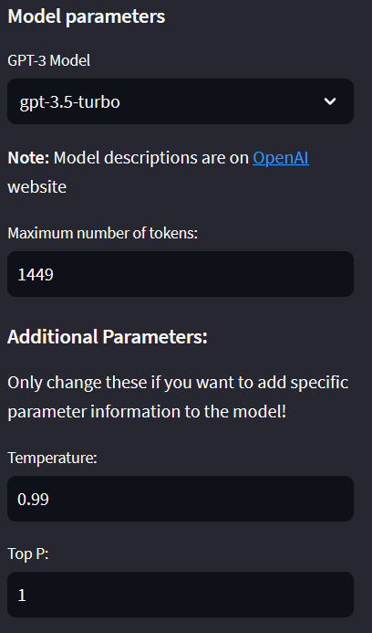

# Cover Letter Generator

Service lets you auto generate cover letters for job proposals.

## Sumary

Text input can be done automatically by parsing data from job description URL page and from resume PDF file (currently under development).

Or it can be done manually by entering text by hand in certain fields.

## Language

Language can be changed by a dropdown menu.

All text is imported from **localization.json** in different languages.

## Model parameters

GPT-3.5 model is used to generate cover letter. It's parameters can be tweaked in order to achieve better results.

